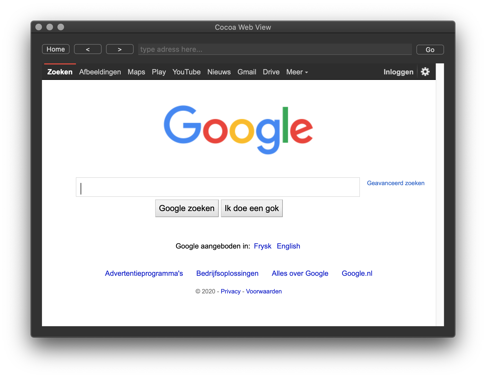

# Cocoa Web View

This repository contains implementation of simple web browser using WKWebView with support for go forward, go back and url validation.

[Cocoa macOS Examples](https://github.com/NikolaGrujic91/Cocoa-macOS-Examples)

In order to use web view it is neccessary to enable Outgoing connections (Client) in Signing & Capabilities tab of project settings

